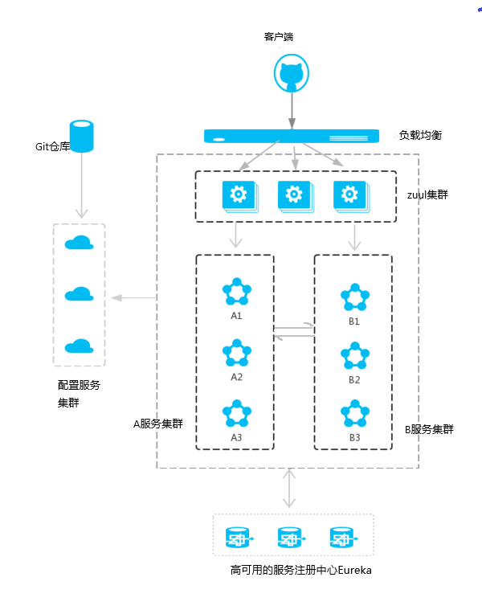

# spring cloud 学习总结
> ## 一. 组件
        1. Eureka(服务注册中心)
            服务注册中心, 管理当前系统启动的服务. 系统的服务都需要再注册中心注册, 才可以被调用. 为了防止因为注册中心崩溃导致的系统瘫痪, 将注册中心设置成高可用, 同时启动多个注册中心, 当一个注册中心出错不能访问, 可以访问其它的注册中心.
        2. EurekaClient
            Eureka的客户端. 这里负责处理具体的业务逻辑, 并返回结果.
        3. Zuul
            路由, 负责转发请求
        4. GateWay
            网关, Zuul的升级版本, 网关控制
        5. Feign(集成了Hystrix, Ribbon)
            Feign集成了Hystrix和Ribbon; Ribbon负责负载均衡(平衡EurekaClient服务集群中单个服务进程的压力); Hystrix负责当服务请求超时或者出错直接返回默认结果, 不需要等待服务响应.
        6. Config
            Spring Cloud 分为两个角色: config server和config client;
            config server从远程仓库获取配置生成相应配置属性属性, config Client从config server获取配置属性.
> **下图为Spring Cloud的架构示意图**

