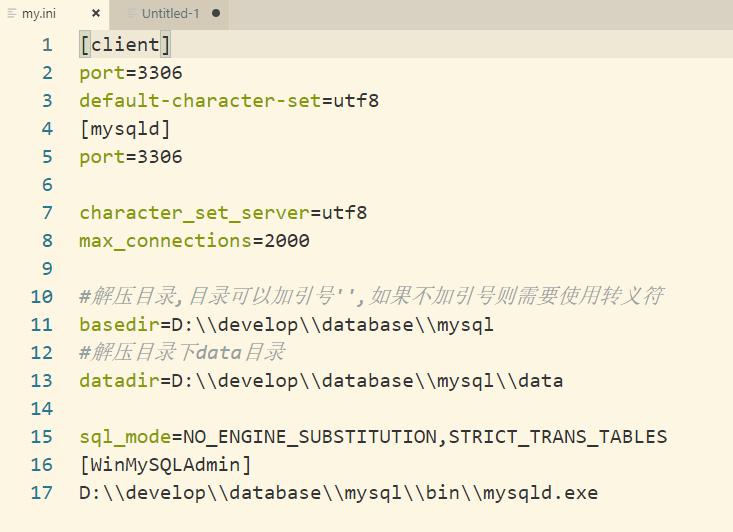

## mysql压缩版安装方法

### 1. 解压,放到安装路径下

### 2. 在bin的同级目录下创建my.ini配置文件
> 

### 3. 初始化数据库
> 在mysql安装目录的bin目录下执行命令
> ```cmd
    mysqld --initialize --console
  
### 4.安装服务
```cmd
mysqld --install [服务名--默认mysql]
# 安装完成后,可以通过命令启动服务
net start mysql
```
### 5. 更改密码
> 执行 mysql -u root -p 命令;输入密码登录mysql
> 然后执行ALTER USER 'root'@'localhost' IDENTIFIED WITH mysql_native_password BY 'password';sql语句来修改密码;

### [参考链接](https://blog.csdn.net/zwj1030711290/article/details/80039780)

# 卸载
1. net stop mysql
2. mysql -remove mysql(服务名)
3. windows下移除注册表mysql
4. 删除本地文件
5. 重启电脑
6. 重新安装